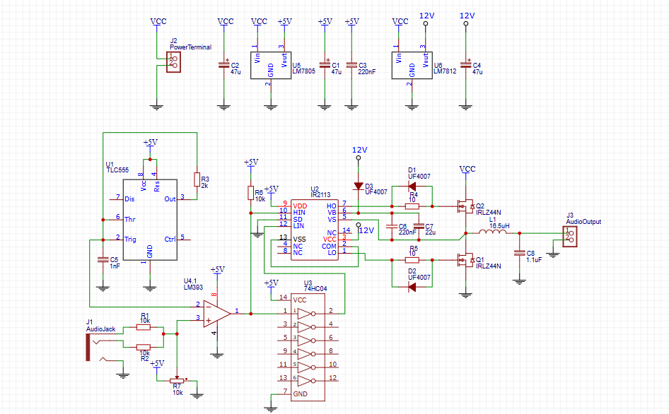

# ⚡ Class D Amplifier using TLC555, LM393, and IR2113

This repository contains a **high-efficiency Class D Power Amplifier** circuit that uses **PWM modulation** and **MOSFET switching** for clean, powerful, and efficient audio amplification.

---

## ⚙️ Working Principle

1. The **TLC555 Timer** generates a stable high-frequency triangular carrier wave.  
2. The **LM393 Comparator** compares this carrier wave with the incoming audio signal from the input jack.  
   - The output is a PWM (Pulse Width Modulated) signal whose duty cycle varies with the amplitude of the input audio.  
3. The **IR2113 Gate Driver** boosts the PWM control signal to drive both the high-side and low-side **IRLZ44N MOSFETs**.  
4. These MOSFETs switch rapidly between supply rails, converting DC power into a high-frequency modulated waveform.  
5. Finally, the **LC Low-Pass Filter** (L1 and C8) smoothens the PWM waveform, reconstructing the amplified analog audio signal for the speaker.

---

## 🧩 Circuit Overview

| Block | Component(s) | Function |
|--------|----------------|-----------|
| PWM Carrier Generator | TLC555 | Generates high-frequency triangular wave |
| Comparator | LM393 | Compares carrier & audio signal |
| Gate Driver | IR2113 | Drives MOSFETs efficiently |
| Power Stage | IRLZ44N (x2) | Switches output at high speed |
| Output Filter | L1, C8 | Removes high-frequency noise |
| Voltage Regulation | LM7805, LM7812 | Provides regulated 5V and 12V rails |

---

## 🧰 Components

| Component | Value / Type |
|------------|---------------|
| U1 | TLC555 Timer |
| U2 | IR2113 Gate Driver |
| U3 | 74HC04 Inverter |
| U4 | LM393 Comparator |
| Q1, Q2 | IRLZ44N MOSFETs |
| L1 | 16.5 µH |
| C8 | 1.1 µF |
| D1, D2 | UF4007 |
| R1–R8 | 10kΩ, 2kΩ (as per schematic) |
| C5 | 1nF (timing capacitor) |
| C1–C4 | 47µF, 220nF (decoupling) |
| J1 | Audio Input Jack |
| J3 | Audio Output Terminal |
| U5 | LM7805 Regulator |
| U6 | LM7812 Regulator |

---

## 🔌 Circuit Diagram

---

## 🧠 Key Features

- High efficiency (>85%)  
- Compact and reliable design  
- Low heat generation  
- Excellent audio clarity  
- Operates from a 12V–24V DC source  

---

## 📊 Performance Overview

| Parameter | Typical Value |
|------------|----------------|
| Supply Voltage | 12V–24V |
| Output Power | ~20–30W |
| Efficiency | 85–90% |
| Frequency Response | 20 Hz – 20 kHz |
| PWM Frequency | ~150 kHz |

---

## 📄 License
This project is open-source under the **MIT License**.

---

## 🙏 Credits
This circuit design and concept were **inspired by the GreatScott! YouTube Channel**, whose educational videos provided valuable insight and motivation to build this amplifier.  
👉 [https://www.youtube.com/c/GreatScottLab](https://www.youtube.com/c/GreatScottLab)
